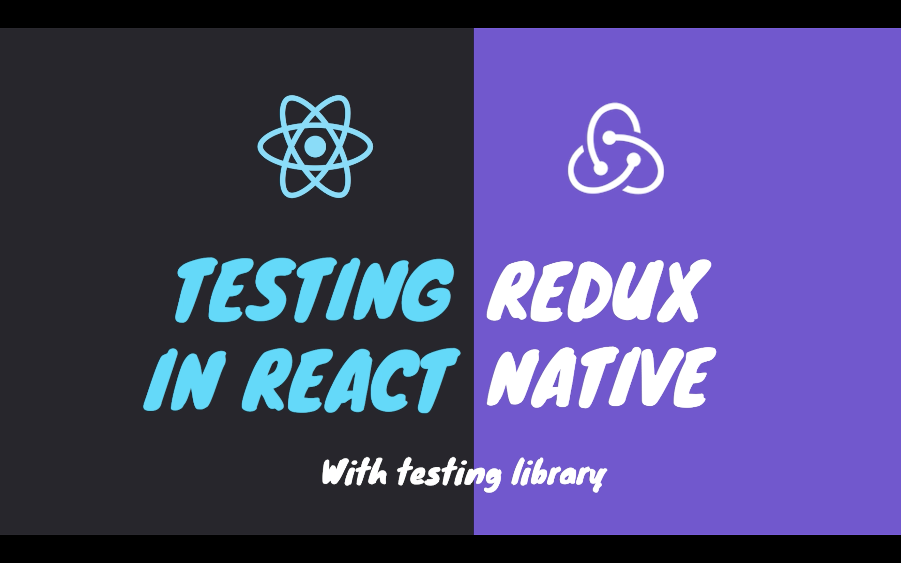

<h1 align="center">
Testing react native and redux
</h1>

<h3 align="center" style="margin: 30px 0">WARNING: this repo is part of a tutorial available at <a target="_blank" rel="noopener noreferrer" href="https://youtu.be/Uh01lkHDaKw">youtube</a></h3>

Testing is a fundamental part of writing professional software. It ensures that your apps work in the way you intend them to. Maintaining and adding features to a small app without tests is a hard task, doing the same to an enterprise-level app, it's just unimaginable.

When I first started studying tests in react native, I found little to no content about it and it motivated me to start creating content on the subject. After my first testing video, many people asked me how to test applications in a wide range of scenarios, such as applications using redux, HTTP requests, and so on.

Hence, I'll be answering those questions through my videos, and the first one is about testing react native apps which use redux

  
  

## Participants

|  |
| :----------------------------------------------------------------------------------------------------------------------------------------------------------------: |

| [Gabriel Eloy](https://github.com/gabrielEloy)

## Getting started

Follow the instructions available on <a target="_blank" rel="noopener noreferrer"  href="https://youtu.be/Uh01lkHDaKw" >the youtube video</a>
